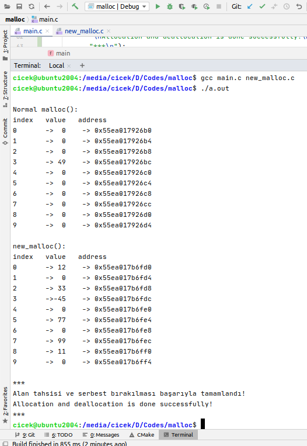

### malloc

- malloc() fonksiyonunun yazılması / bitirme projesi - Bahar 2020

- C standard: C11

- Main source: Ritchie, D.M. and Kernighan, B.W. 1988. _The C Programming Language_. 
Prentice-Hall, Chapter 5, 7, 8 and Appendix B.5

---

### Installation

- Clone repository:

<pre>
  $ git clone https://github.com/bayramcicek/malloc.git
  $ cd ./malloc
</pre>

- Run:

<pre>
  $ gcc main.c new_malloc.c
  $ ./a.out
</pre>

- Output:

